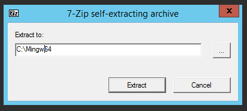
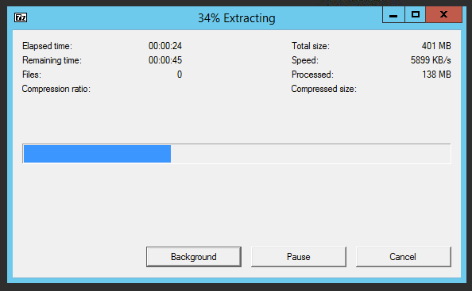
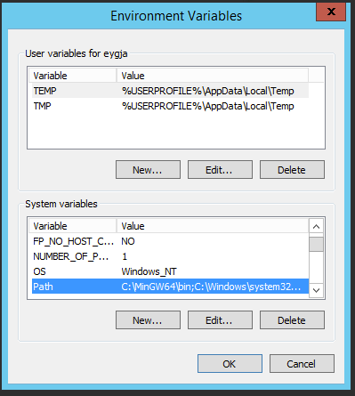
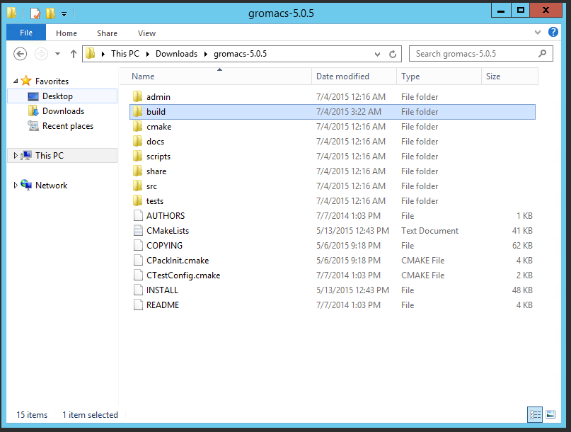
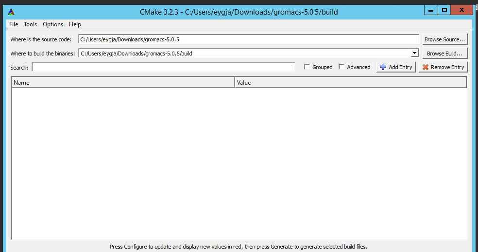

GROMACS Install
===============

This walkthough follows the steps to install compatible versions of libraries and build tools for a minimum functioning version of GROMACS.The following packages/libraries are necessary for a complete build and install:

- mingw
- boost
- cmake
- fftw3

Other requirements like the the CUDA and MPI extensions are needed if your system will beable to support them by either having the appropriate hardware and/or available clusterd machines.

Installation on 64-bit Windows Computers
-------------------------------------
### MinGW

MinGW, short for "Minimalist GCC for Windows", is a compiler for Windows based on the GCC compiler.The default official version http://sourceforge.net/projects/mingw/files/ "mingw-get-setup.exe" is a 32-bit version which we will not use in our case instead opting for the 64-bit forked version from https://nuwe.net/mingw.html , as a bonus it comes included with the latest Boost libraries.

To start, download the MinGW installer from here:

http://nuwen.net/files/mingw/mingw-13.0-without-git.exe

Follow the instructions after launching the exe to select the appropriate location to place the extracted files.This an be C:/ giving us a install directory as C:/MinGW.

**IMPORTANT:At this point the MinGW must be added to the PATH , else the cmake utility will encounter issues trying to find the appropriate compiler versions.**

Open your start menu and right click on "Computer" and choose "Properties". On the left hand side of the window that opens, choose "Advanced System Settings". In the new window that opens, click the "Environment Variables..." button. Scroll down in the lower list to find the PATH variable:

And add the location of the extracted version in the value section i.e C:/MingGW/bin;

Accept the changes and close the dialog windows.

### Cmake

CMake, short for "Cross-patform Make", is a tool that allows projects to easily be built with a multitude of compilers on a multitude of systems.
Simply download and install the latest version of CMake:

http://www.cmake.org/cmake/resources/software.html (Look under "Binary Distributions" for Windows)

### fftw3

FFTW is a C subroutine library for computing the discrete Fourier transform (DFT) in one or more dimensions, of arbitrary input size, and of both real and complex data (as well as of even/odd data, i.e. the discrete cosine/sine transforms or DCT/DST).

The compiled libraries are downloadable from here:

ftp://ftp.fftw.org/pub/fftw/fftw-3.3.4-dll64.zip

However in this instance we will use the builtin fftw supplied by GROMACS to get a version running in the fastest possible time.

Prerequisites being satisfied it is now time to build the GROMACS.

### GROMACS 

Latest version downloadble from http://www.gromacs.org/Downloads releases table.

At the time stable release available 5.0.5 available from:

ftp://ftp.gromacs.org/pub/gromacs/gromacs-5.0.5.tar.gz

Extract the contents in a suitable location and after change to that location and create a directory name build within it.

Within the cmake GUI reference the required paths in source and buils sections:

Press configure , in the popup select MinGW Makefiles as the generator for the project.And use default native compilers.
Any errors thrown can be corrected by checking the switches at this point adding/removing as needed.

The following are available dpending on your Computer's architecture and available libraries:

- CMAKE_C_COMPILER=xxx equal to the name of the C99 compiler you wish to use (or the environment variable CC)
- CMAKE_CXX_COMPILER=xxx equal to the name of the C++98 compiler you wish to use (or the environment variable CXX)
- GMX_MPI=on to build using an MPI wrapper compiler
- GMX_GPU=on to build using nvcc to run with an NVIDIA GPU
- GMX_SIMD=xxx to specify the level of SIMD support of the node on which mdrun will run
- GMX_BUILD_MDRUN_ONLY=on to build only the mdrun binary, e.g. for compute cluster back-end nodes
- GMX_DOUBLE=on to run GROMACS in double precision (slower, and not normally useful)
- CMAKE_PREFIX_PATH=xxx to add a non-standard location for CMake to search for libraries
- CMAKE_INSTALL_PREFIX=xxx to install GROMACS to a non-standard location (default /usr/local/gromacs)
- BUILD_SHARED_LIBS=off to turn off the building of shared libraries
- GMX_FFT_LIBRARY=xxx to select whether to use fftw, mkl or fftpack libraries for FFT support
- CMAKE_BUILD_TYPE=Debug to build GROMACS in debug mode

Once the configure comletes without any issues the generate step can be run.

Finally change to the build director that you creatd , there you will find the files that the previous two actions produced.

Open a CMD shell i this location and run the following sequence of instructions:

- make
- make install

This will compile the gromacs executable binary and install into an appropriate folder in the Program Files of your Windows installation.

-

